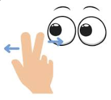

# EYE-EXCERCISE

En este ejercicio se presenta la animacion mediante el uso de estilos CSS y HTML con JavaScript para simular el movimiento de un par de ojos moviendose en la direccion del cursor del mouse en la pantalla. 
